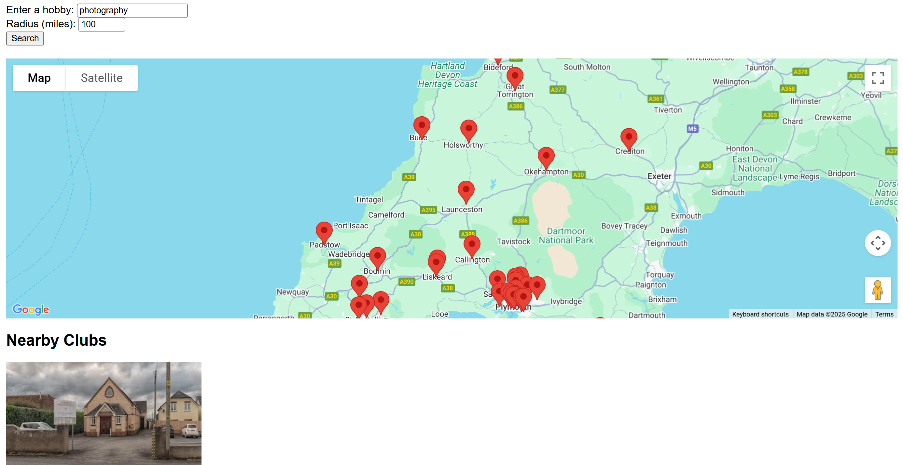

Project Two: Pastimez hobby finder
======================================
**Author:** *Tyler Worth*

# Project Description

A javaScript powered site using Google maps API to allow users to locate local hobby groups and clubs near them.

# Website Purpose

The purpose of this website project is to empower its users to build local community and social relationships, nurture healthy habits for both their physical fitness and mental health and raise local awareness for hobby and interest groups in communities.

# Links

- Website Deployment: https://cutbacktg.github.io/pastimez/index.html
- Github Repository: https://github.com/CutbackTG/pastimez

# Features

Pastimez features an interactive search form and google api driven map display for the user to search in their determined local radius for hobbies and interest clubs and societies.

It also features (if fully realized) an expanded search for hobbies and interests that the user may not have considered in their local area.

An interactive navigation bar that takes the user to the relevant page section and a return to top button.
Interactive Social media links ready for linking to target social media accounts for Pastimez.

# Limitations

Clubs, societies and organisations located using the Pastimez hobby finder are currently limited to those registered with Google as business or organisations, there are many more clubs and social activity groups out there so if you don't find the perfect pastime for you using this website please, venture out, explore and look out for those delightful little adverts in your local shops and libraries inviting you to join in with a local social circle.

# Technologies Used

- HTML5: For the structure and content of the website.
- CSS3: For styling the site with custom layouts and designs.
- Git: Version control to manage project files.
- GitHub Pages: Hosting the live version of the project.
- javaScript: for user interaction and advanced styling.
- Bootstrap for useful containers, accordians and carousels.
- Jest: For core functionality testing.

# Website Walkthrough

**Landing section & About**

The Pastimez site opens on a visually branded interactive navigation bar and logo followed by our Hero image carousel that displays uplifting and inspirational images and the benefits of engaging in hobby activities to drive interest in the audience.

Below this the user flows into the our search form for our interactive hobby finder with questions to aid the search including their interests or hobby choice, (or search by category), whether they prefer indoor or outdoor activities and their search radius in miles (or how far they are willing to travel.)

Once submitted and validation checks have run, the user is presented with a google map of pinned local clubs and societies that meet their search options. Details and website links for these clubs are also displayed below the map in a card carousel for easier reading.

Further down users can Discover other local hobby clubs and societies that they may not have considered in their search criteria, if fully functional this section would run independant of the search form and allow browing and hobby discovery.

And lastly below this is an interactive social media footer with links to our social media pages.

# User Experience (UX)

# User Stories

**1. First-Time Visitor 1:**

User story 1 - Ella, 19, University Student

* As a first-year university student who just moved to a new city, I want to easily search for a local book or D&D club, so that I can meet new people and join social circles around my interests.

**Acceptance Criteria**

- The user can search for hobby clubs by category or more bespoke terms such as "D&D"

- The platform displays clubs near the user's selected location.

- Each result includes basic information: name, location and description of the club.

- The user can click on a club to get contact or sign-up info.

**2. First-Time Visitor 2:**

User story 2 - Marcus, 37, a Chef with a Passion for Art

* As a busy professional with limited free time, I want to find creative hobby clubs happening nearby during weekends, so that I can relax and enjoy my passion for painting without spending hours searching or phoning around.

**Acceptance Criteria**

- The user can filter search results by activity type and availability.

- Clubs are displayed by proximity to the user or a chosen location.

- Results include session times to help users find ones that match their schedule.

- The interface is mobile-friendly for quick searching on the go.

**3. First-time Visitor 3**

User story 3 - Janet, 64, Recently retired

* As a recently retired person with time to explore new hobbies, I want to browse a variety of clubs by interest, so that I can meet like-minded people.

**Acceptance Criteria**

- The user can browse clubs and societies by keywords or interests

- Th eplatform returns multiple suggestions across different categories.

- Each suggestion includes a short description and joining information.

- The interface is accessible and easy to use for older users.

**3. Returning Visitor**

User story 4 - Alex, 28, Board game enthusiast

* As a returning user who has already joined a local group, I wanted to check the platform regularly for new clubs and upcoming meetups, so that I can keep expanding my social circle and try new hobbies.

**Acceptance Criteria**

- The homepage highlights new or recently added clubs.

- The user can save interests or categories for faster future searches.

- There's an option to subscribe to notifications or updates for new clubs.

- The search experience remains quick and intuitive with updated listings.

Please visit section [Testing User stories from User Experience (UX)] for targeted testing to match these user defined requirements. 

# Design

Typography
The main font used throughout is the Arial font, a sans-serif font chosen for its modern design, readability and clean aesthetics with a fallback font of sans-serif if the user's browser fails to load Arial for any reason.

**Wireframes**

The initial concept for the Pastimez web application was to have it resemble the accordian type forms and menu options in role-playing-game classics such as "The Legend of Zelda" and the "Pokemon" series with graphic carousels showing the results and an added Discove rmore section where users can browse other local clubs with hobby ideas that may not have initially occurred to them.

The large hero carousel should include inspirational and informative lines on the benefits of taking part in hobbies and social activities to drive interest in exploration, immediately followed by the search form (the major CTA of the website)

The design should also include social links in the footer for further social contact and information sharing on hobby culture.

**Colour scheme**

The website will be designed in a super-clean and fresh mix of white #ffffff a custom purple hue #6a1b9a adding natural high contrast for accessiblity and legibility across the site, and an off-white grey for shade and subtle blend #f0f0f080 adding natural high contrast for accessiblity and legibility across the site.

# Testing & Accessibility

**Accessibility - Lighthouse Rating**

I am pleasantly surprised with the site's lighthouse accessiblity ratings even though the performance score was unable to record due to me working on this project from a remote work location during the test.

Points to note however are; 
For accessibility - My navbar button does not have an accessible name and will just be screen read as button.

For Best Practices - The site immediately asks to know your location on launch, this should be softened to request after validation of the search form so the user doesn't feel like they are giving up personal information first.
I kept it in this state as I really wanted to be able to populate the Discover More section on launch but was unable to figure it out fully with this first effort.

**Testing User Stories from User Experience (UX)**

User Story 1 – Ella (First-Year University Student)
“As a first-year university student who just moved to a new city, I want to easily search for local book or D&D clubs, so that I can meet new people and join social activities around my interests.”

| Acceptance Criterion                  | Evidence                                                                                                                                                                                          | Met?         |
| ------------------------------------- | ------------------------------------------------------------------------------------------------------------------------------------------------------------------------------------------------- | ------------ |
| **Search by category**                | `<select id="categorySelect">` lets users pick a hobby category. JavaScript uses `categorySelect.value` to map to a keyword with `categoryKeywords`, then searches Google Places API accordingly. | ✅            |
| **Results near the user**             | Uses `navigator.geolocation.getCurrentPosition` to set `userLocation`, which is passed to Google Maps `nearbySearch` to show results in a chosen radius.                                          | ✅            |
| **Each result shows name & location** | Each result card includes the club name and address using `place.name` and `place.vicinity`.                                                                                                      | ✅            |
| **Clickable contact / sign-up info**  | A "View on Google Maps" link is provided via `https://www.google.com/maps/search/?api=1&query=${lat},${lng}`, but no direct sign-up or contact integration yet.                                   | ⚠️ *Partial* |

User Story 2 – Marcus (Chef with a Passion for Art)
“As a busy professional with limited free time, I want to find creative hobby clubs happening nearby during weekends, so that I can relax and enjoy my passion for painting.”

| Acceptance Criterion              | Evidence                                                                                                                  | Met? |
| --------------------------------- | ------------------------------------------------------------------------------------------------------------------------- | ---- |
| **Filter by activity type**       | Users can select from a list of categories or input a keyword (e.g., "painting"), which gets mapped and queried.          | ✅    |
| **Filter by proximity**           | A radius slider/input allows filtering by distance. Converted via `radiusMeters = radiusMiles * 1609.34` before API call. | ✅    |
| **Filter by day/time (weekends)** | No current way to filter by specific days or times.                                                                       | ❌    |
| **Mobile-friendly search**        | Uses responsive Bootstrap layout (`container-fluid`, `row`, `card h-100`) and works well on small screens.                | ✅    |

User Story 3 – Janet (Recently Retired)
“As a recently retired person with time to explore new hobbies, I want to browse a variety of clubs by interest or tag, so that I can try new activities and meet like-minded people.”

| Acceptance Criterion                       | Evidence                                                                                                      | Met?         |
| ------------------------------------------ | ------------------------------------------------------------------------------------------------------------- | ------------ |
| **Browse by keyword or interest tag**      | The `INTERESTS` array generates clickable interest tags that filter results via `renderDiscoverResults()`.    | ✅            |
| **Multiple suggestions across categories** | Up to 12 nearby clubs are shown by default (`discoverResults.slice(0, 12)`), pulled from Google Places API.   | ✅            |
| **Description & joining info**             | Each card shows name and address, and Google Maps links help with further exploration. No email/phone listed. | ⚠️ *Partial* |
| **Accessible and easy-to-use interface**   | Uses semantic HTML, proper labels, `alt` attributes, and clear typography. Accessible to older users.         | ✅            |

User Story 4 – Alex (Returning Board Game Enthusiast)
“As a returning user who has already joined a local group, I want to check the platform regularly for new clubs and upcoming meetups, so that I can keep expanding my social circle and try new hobbies.”

| Acceptance Criterion                           | Evidence                                                                            | Met? |
| ---------------------------------------------- | ----------------------------------------------------------------------------------- | ---- |
| **Homepage highlights new/nearby clubs**       | "Discover Clubs Nearby" auto-renders on page load using current location.           | ✅    |
| **Save interests for quicker future searches** | No persistent storage (e.g., `localStorage`) implemented yet. Tags reset on reload. | ❌    |
| **Subscribe to notifications**                 | No email subscription or push notification system yet.                              | ❌    |
| **Fast, intuitive search**                     | Single-page app with a fast form and clear flow. No page reload needed.             | ✅    |

**Bugs Known**

No Validation for Empty Keyword Input
Issue:
Clicking "Search" without entering a hobby or selecting a category triggers an unnecessary API call.

This bug is caused by the option we have included for users to bypass the specific hobby search option by choosing from our predetermined categories, functionality is not affected and it is important for the user to have this natural option.

* The next two bugs are linked to our experimental design in generating tags that would allow the user to sort through results in their area by hobby type, unfortunately I could not get this function to work without the user still doing the initial search and so it was simplified to simply show local results in the grid.

Missing ARIA Labels on Interest Tag Buttons
Issue:
The generated interest buttons aren’t accessible to screen readers.

Interest Tags Do Not Toggle Off
Issue:
Clicking an interest tag highlights it and filters results, but clicking the same tag again does not deselect or reset.

**Test-driven Development (Jest testing)**

In an effort to implement test-driven development on this project I ran some initial tests with jest (see test.js) to ensure that our basic functionality and data manipulation was working for our our search form.
These tests allowed me to ensure that we were able to search by keywords and by category and also to fail tests when no inputs were added or when no matches were found.

I also tested whether our map would generate the map marker on initialisation and further testing of our other search form options such as the indoor/ outdoor preference.

**Solved Bugs:**

# Deployment

**Installation**
If you’d like to clone the project and work locally, follow these steps:

**Clone the repository:**

- Copy
`git clone https://github.com/cutbacktg/pastimez.git`
Navigate to the project directory:

- Copy
`cd pastimez`
Open index.html in a web browser to view the site.

**Deployment**

This section guides you through the process of deploying your web application to Github Pages from your project repository.

**Pre-requisites:**
- A github account.
- A github repository or clone of your web project already pushed to it.

**Step 1: Prepare Your Repository**
Check that your project is in a GitHub repository. If you haven't already created one, follow these steps:

1. Create a new repository on GitHub:
- Go to GitHub and log in.
- Click the + icon at the top-right of the page and select New repository.
- Name your repository (e.g., infernal-festival).
- Make sure to initialize the repository with a README file (optional).
- After creating the repository, you will see instructions to push an existing project.

2. Push your local project to Github (if you haven't already done so):
If you have an existing project:
- Open your terminal or command line and navigate to the project folder.

Use the following commands to push your project to Github:

- `git init`  # If your project isn't already a Git repository
- `git add .` # Add all files to the staging area
- `git commit -m "Initial commit"`  # Commit the changes
- `git branch -M main`  # Rename your default branch to 'main'
- `git remote add origin https://github.com/yourusername/pastimez.git`  # Replace with your repository URL
- `git push -u origin main`  # Push to GitHub

**Step 2: Enable Github Pages**

1. Navigate to the settings on your repository page on Github.
- Open the repository on Github.
- Click on the ***settings*** tab located in the top menu of your repository.

2. Find the Github Pages section:
- Scroll down until you find the ***Github Pages*** section under the ***Code and automation*** category.

3. Choose a source branch for deployment:
- In the ***Source*** dropdown, select the branch you want to deploy (usually ***main*** or ***master***)
- After selcting your branch, Github Pages will automatically start building and deploying the website

4. Select the root folder (if necessary):
- Usually the root folder will be enough. However, if you have your site in a specific folder (like ***/docs*** etc), choose that folder instead.
- If your website's ***index.html*** file is in the root of your repository, no folder selection is necessary.

5. Save the changes:
 - After selecting the branch and folder (if applicable), Github will begin deploying your site. This may take several minutes depending upon the size of your site.

 **Step 3: Access your live website**

 Once Github Pages has finished building your site, you can access it via a URL.

 1. Find your Github Pages URL:
 - In the ***Github Pages*** section under ***settings***, you will see a URL that will look like:
 https://yourusername.githuib.io/pastimez/ 
 - This URL is your live website (as stated previously, this may take a minute or two to appear, simply refresh the page periodically until it appears on the page)
 - Click the link to open your deployed website in your browser.

 **Step 4: Updating your website**

 Any time you make updates or changes to your project (e.g., editing HTML, CSS, or JavaScript), follow these steps to update your live website:

 1. Make changes to your project locally
 - Edit your files as needed in your local project directory as normal.

 2. Commit your changes in your Terminal or command line.
 - `git add .` (adds all changed files)
 - `git commit -m "Update website content"` (Commits your changes)

 3. Push the changes to Github:
 - `git push origin main` (Push to Github main branch)

 4. Wait for Github Pages to rebuild the site:
 - After pushing your changes, Github Pages will automatically rebuild your site with your new content.
 - Refresh the live URL to view your changes.

**Step 5: Troubleshooting**

Site not showing up after deployment?

- Double-check that your index.html file is in the root directory of your repository. GitHub Pages needs this file to display your website.
- Check for typos in your file names or references to other resources (like CSS or JS files).
- Make sure you've committed and pushed all your files to the repository.

Assets (images, CSS, etc.) not loading correctly?

- Ensure the file paths for your assets are correct. GitHub Pages is case-sensitive, so make sure file names are properly capitalized.

**Usage**

Once the site is open in your browser, users can:

Browse the site: View the event site, see the band line-up, contact for information on tickets and camping for the event and view the gallery of previous event photography.

**Contributing**

If you'd like to contribute to this project, feel free to fork the repository, make changes, and submit a pull request. Contributions are welcome to improve features, fix bugs, or enhance the UI.

- Fork the repository.
- Clone your forked version.
- Make your changes and commit them.
- Push your changes back to your fork.
- Submit a pull request with a description of your changes.

# Credits

**Acknowledgements**

Guidance: Special thanks to The Code Institute for their support in helping me build and refine this first project.

# Code:

# Media:

# References
